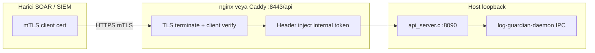

# Ban API — mTLS ve ikinci token tasarımı (Enterprise spike)

**Durum:** Tasarım notu (2026-07-07) — **henüz kod yok**. Laptop demo: mevcut `API_TOKEN` + `API_BIND=127.0.0.1` yeterli.

İlgili: [SECURITY_PROFILES.md](SECURITY_PROFILES.md) · [ENTERPRISE_SUPPORT.md](ENTERPRISE_SUPPORT.md) · `api_server.c` · `scripts/ensure_api_security.sh`

---

## Mevcut model (Community / Production)

| Katman | Davranış | Dosya |
|--------|----------|-------|
| Bind | Varsayılan `127.0.0.1:8090` | `rules.conf` → `API_BIND` |
| Auth | `GUARDIAN_API_TOKEN` — `Authorization: Bearer` veya `X-Guardian-Token` | `api_server.c` |
| Fail-closed | Token yok veya eşleşmez → **403** | `api_check_mutation_auth` |
| Read / mutate | Aynı token (ban, consult, read) | `api_check_read_auth` → mutation |
| nginx inline | Consult token host header enjekte | `sync_nginx_consult_token.sh` |
| Dashboard | Token `sync_dashboard_api_token.sh` ile senkron | Docker env |
| IPC (daemon) | Unix socket + `ipc_auth` token + uid peer | `ipc_auth.c`, `daemon_ipc.c` |

**Enterprise boşluk:** Harici SIEM / SOAR’ın ban API’ye **doğrudan** (loopback dışı) erişmesi gerektiğinde tek shared secret yetmez — müşteri **mTLS + ayrı mutation token** ister.

---

## Hedef (Enterprise)

1. **mTLS** — yalnızca onaylı istemci sertifikası olan çağrılar edge’e ulaşır.
2. **İkinci token** — mutation (ban/unban/consult) için read-only’tan ayrı secret veya cert CN eşlemesi.
3. **Loopback korunur** — `log-guardian` process hâlâ `127.0.0.1:8090`; TLS termination reverse proxy’de.
4. **Geriye uyum** — Community profil değişmez; Enterprise `GUARDIAN_API_MTLS=1` ile açılır.

---

## Önerilen mimari (Phase 1 — nginx/Caddy terminate)



| Adım | Bileşen | Not |
|------|---------|-----|
| 1 | `client_ca.crt` + istemci cert | Müşteri PKI veya `scripts/mtls_client_issue.sh` (gelecek) |
| 2 | nginx `ssl_verify_client on` | `examples/nginx-api-mtls.conf` (gelecek) |
| 3 | `proxy_pass http://127.0.0.1:8090` | Yalnızca verified client |
| 4 | Internal header | `X-Guardian-Token: $internal_mutation_token` — **dışarı sızmaz** |
| 5 | `API_BIND=127.0.0.1` | Değişmez |

**Neden native TLS `api_server.c` içinde değil:** Mevcut HTTP minimal stack; nginx/Caddy zaten prod stack’te (`docker-compose.prod.yml`, `deploy/Caddyfile`). Sertifika rotasyonu ve OCSP edge’de standart.

---

## İkinci token modeli

| Token | Env / rules.conf | Yetki | Kullanıcı |
|-------|------------------|-------|-----------|
| **READ** | `API_TOKEN` (mevcut) | `GET /api/v1/*`, metrics relay | Dashboard read, Grafana |
| **MUTATE** | `API_MUTATION_TOKEN` (yeni) | `POST` ban, consult, unban | SOAR, dashboard ban butonu |
| **INTERNAL** | nginx inject only | Loopback proxy → 8090 | mTLS edge sonrası |

### Doğrulama sırası (`api_server.c` — gelecek patch)

```
1. Method GET  → API_TOKEN veya API_MUTATION_TOKEN (ikisi de OK)
2. Method POST → API_MUTATION_TOKEN zorunlu (API_TOKEN tek başına RED)
3. GUARDIAN_API_MTLS_STRICT=1 → X-Forwarded-For dış POST reddedilir (yalnızca 127.0.0.1 veya trusted proxy)
4. Opsiyonel: client cert CN == env GUARDIAN_MTLS_CLIENT_CN_ALLOWLIST
```

### Dashboard senkron

- `sync_dashboard_api_token.sh` → mutation token’ı Docker env’e yazar (`GUARDIAN_API_MUTATION_TOKEN`).
- Read-only API anahtarı ayrı panelde (Enterprise tier) — fleet komut imzasına benzer ayrım.

---

## Konfigürasyon taslağı

`/etc/log-guardian/rules.conf` (Enterprise):

```ini
API_BIND=127.0.0.1
API_TOKEN=<read-hex-32>
API_MUTATION_TOKEN=<mutate-hex-32>
GUARDIAN_API_MTLS=1
GUARDIAN_API_MTLS_STRICT=1
```

`/etc/log-guardian/env` (process):

```bash
GUARDIAN_API_TOKEN=<read>
GUARDIAN_API_MUTATION_TOKEN=<mutate>
GUARDIAN_API_MTLS_STRICT=1
```

nginx snippet (özet):

```nginx
ssl_client_certificate /etc/log-guardian/mtls/client_ca.pem;
ssl_verify_client on;
location /api/v1/ {
    if ($ssl_client_verify != SUCCESS) { return 403; }
    proxy_set_header X-Guardian-Token "<internal-mutation-token>";
    proxy_pass http://127.0.0.1:8090;
}
```

---

## Uygulama fazları

| Faz | İş | Dosyalar | Kapı |
|-----|-----|----------|------|
| **0** | Bu tasarım | `docs/BAN_API_MTLS_DESIGN.md` | — |
| **1** | nginx mTLS örnek + `mtls_client_issue.sh` | `examples/nginx-api-mtls.conf` | Manuel curl mTLS |
| **2** | `API_MUTATION_TOKEN` ayrımı | `api_server.c`, `ensure_api_security.sh` | `api_fail_closed_test.sh` genişlet |
| **3** | Enterprise gate | `scripts/ban_api_mtls_e2e.sh` | `competitive-proof` +1 kart (opsiyonel) |
| **4** | Caddy prod stack | `deploy/Caddyfile` | `prod_stack_e2e.sh` |

**Tahmini diff (Faz 2):** ~80 satır C (`api_check_mutation_auth` ayrımı), ~40 satır shell, doküman — **ban pipeline / firewall / WAF dokunulmaz**.

---

## Test planı (Faz 3 kapısı)

```bash
# 1. Token ayrımı
curl -H "Authorization: Bearer $API_TOKEN" -X POST .../ban   # → 403
curl -H "Authorization: Bearer $API_MUTATION_TOKEN" ...      # → 200

# 2. mTLS
curl --cert client.pem --key client.key https://host/api/v1/ban?ip=203.0.113.254
curl https://host/api/v1/ban   # sertifikasız → 403

# 3. Fail-closed
unset API_MUTATION_TOKEN → tüm POST 403
```

Rapor: `ban-api-mtls-report.json` — `pass`, `mtls_verify`, `read_token_post_reject`, `mutation_ok`.

---

## Riskler ve kararlar

| Risk | Azaltma |
|------|---------|
| Token sızıntısı (nginx config) | Internal token yalnızca `include` dosyasında, chmod 600 |
| mTLS bypass (doğrudan 8090) | `API_BIND=127.0.0.1` + firewall (mevcut) |
| Dashboard kırılması | Migration: mutation token otomatik üret + sync |
| Community karmaşıklığı | Varsayılan: tek token; mutation ayrımı Enterprise flag |

---

## Operatör checklist (müşteri Enterprise)

1. `sudo bash scripts/ensure_api_security.sh` — read + mutation token üret (gelecek flag: `ENTERPRISE_API=1`)
2. nginx mTLS config deploy + `nginx -t`
3. `bash scripts/ban_api_mtls_e2e.sh` (gelecek)
4. `bash scripts/enterprise_e9_verify.sh` — mevcut zincir bozulmamalı

---

## Özet

- **Şimdi:** Tasarım onaylı; laptop **değişiklik yok**.
- **İlk kod:** `API_MUTATION_TOKEN` ayrımı (Faz 2) — en yüksek ROI, mTLS olmadan da değerli.
- **mTLS:** Edge proxy terminate; `api_server.c`’ye minimal `MUTATION_TOKEN` guard yeterli.
