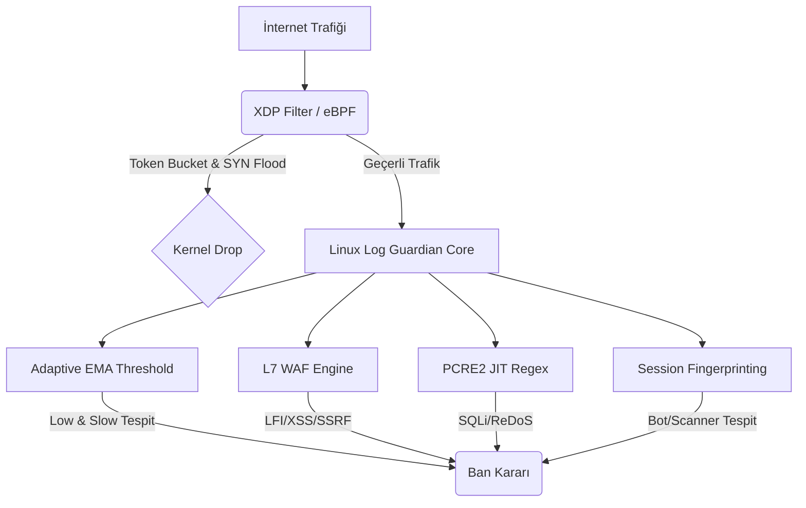

# Linux Log Guardian — Detaylı kurulum rehberi

> **GitHub giriş:** [README.md](../README.md) (TR + EN özet). Bu dosya uzun kurulum ve faz notları içindir.

---

## Production beta — Self-hosted nginx koruma

# 🛡️ Linux Log Guardian

> **Log analizinden kernel ban'a tek zincir** — nginx access log → WAF/CRS → IPC → XDP/ipset  
> Kendi sunucunuzda çalışır; Cloudflare/CrowdStrike yerine geçmez, tamamlar.

| Katman | Ne zaman? | Giriş |
|--------|-----------|-------|
| **Core** | Her müşteri — 15 dk kurulum | [QUICKSTART_NGINX](docs/QUICKSTART_NGINX.md) |
| **Pro** | SOC, filo, Grafana | [QUICKSTART_DOCKER](docs/QUICKSTART_DOCKER.md) · [GRAFANA_SETUP](docs/GRAFANA_SETUP.md) |
| **Opsiyonel** | XDR, Wasm, LLM Copilot | [PERSONAL_TEST](docs/PERSONAL_TEST.md) · [SCOPE_COVERAGE](docs/SCOPE_COVERAGE.md) |

Marka ve isimlendirme: [docs/BRANDING.md](docs/BRANDING.md) · Agent/modül haritası: [AGENTS.md](AGENTS.md)

**15 dakikada nginx:** [docs/QUICKSTART_NGINX.md](docs/QUICKSTART_NGINX.md)

**Yerel kurulum (adım adım, Mint/Ubuntu):** [docs/INSTALL_STEP_BY_STEP.md](docs/INSTALL_STEP_BY_STEP.md)

**Dashboard tek komut (Docker):** [docs/QUICKSTART_DOCKER.md](docs/QUICKSTART_DOCKER.md) · **TLS prod:** [docs/TLS_PRODUCTION.md](docs/TLS_PRODUCTION.md) · **72h soak:** [docs/SOAK_TEST.md](docs/SOAK_TEST.md)  
**npm (kök dizin):** `npm run guardian:prod` · `npm run dashboard:dev` — `package.json` repo kökünde  
**Kişisel test (tüm fazlar):** [docs/PERSONAL_TEST.md](docs/PERSONAL_TEST.md)  
**Fleet Online:** [docs/FLEET_ONLINE.md](docs/FLEET_ONLINE.md) · **Benchmark:** [docs/BENCHMARK.md](docs/BENCHMARK.md) · **Falco eşleme:** [docs/FALCO_RULES.md](docs/FALCO_RULES.md)  
**Kurulum gereksinimleri:** [docs/CUSTOMER_REQUIREMENTS.md](docs/CUSTOMER_REQUIREMENTS.md) · **Kanıt paketi:** [docs/DATA_ROOM.md](docs/DATA_ROOM.md) · **Prod yol haritası:** [docs/PROD_ROADMAP.md](docs/PROD_ROADMAP.md) · **Kapsam:** [docs/SCOPE_COVERAGE.md](docs/SCOPE_COVERAGE.md)

**Lisans:** MIT — açık kaynak, self-hosted.

---

## Hızlı test (geliştirme)

```bash
make -j$(nproc)
export LOGANALYZER_PASSWORD='DegistirBeni!123'   # rules.conf varsayılan KDF
./log-guardian test_access.log --no-tui --json --no-ban --rules test_rules.conf
./log-guardian --health    # IPC + daemon_stats + GET /metrics
./log-guardian --status    # son 10 alarm, aktif ban, EPS (jq ile okunur)
bash scripts/bench_report.sh   # throughput + bellek raporu
bash scripts/run-all-e2e.sh    # smoke + incident + lineage + fp (+ fleet opsiyonel)
# Prod stack (Wasm + lineage + L7) — oncelik 1
bash scripts/prod_stack_e2e.sh
# Rekabet odakli gelistirme — tek komut kanit
bash scripts/competitive_suite.sh   # bench + FP + falco import
bash scripts/phase100.sh       # Faz 0-5 %100 kapisi
bash scripts/phase_complete.sh # phase100 + phase_gate
bash scripts/phase_gate.sh     # Dosya + derleme kontrolu
make bench-run             # scripts/bench.sh (kisa)
```

Üretimde önce root ile `log-guardian-daemon --iface <NIC>` başlatın, sonra analyzer (`--follow`).

### Dalga D (Faz 4 — Fleet MVP)

| Ozellik | Komut |
|--------|--------|
| Dashboard fleet (canli agent listesi) | `/fleet` — `/api/fleet` telemetry |
| Komut push | `POST /api/fleet/commands` → agent poll |
| Prometheus multi-tenant | `loganalyzer_*{tenant_id="..."}` |
| Fleet E2E | `cd dashboard && npx prisma db push && node prisma/seed.mjs` sonra `bash scripts/fleet_e2e.sh` |

`rules.conf`: `TENANT_ID=default` + `SAAS_TOKEN` (`install.sh` uretir veya dashboard API key)

### Dalga C (Faz 2 — XDR korelasyon)

| Ozellik | Komut |
|--------|--------|
| INCIDENT_ID (log + eBPF) | `INCIDENT_WINDOW_SEC=600` + otomatik |
| Korelasyon testi | `./log-guardian incident-sim` |
| Helm (K8s) | `helm install lg ./helm/log-guardian` |
| E2E smoke | `bash scripts/incident_e2e.sh` |

### Dalga B (rakip farki)

| Ozellik | Komut |
|--------|--------|
| Mesh tek kanal (etcd) | `rules.conf`: `MESH_BACKEND=etcd`, ZMQ kapali |
| OpenAPI strict ban | `OPENAPI_STRICT=1` + `OPENAPI_SCHEMA=examples/openapi-mini.json` |
| Lineage E2E smoke | `bash scripts/lineage_e2e.sh` |
| FP raporu | `bash scripts/fp_report.sh` |

### Faz 2 — Lineage + OpenAPI (beta)

```bash
# Nginx log format: examples/nginx-log-guardian.conf ($request_body + \" escape)

# OpenAPI + JSON body (2 satir test)
./log-guardian test_schema_access.log --no-tui --rules rules.conf --no-ban

# Lineage (daemon yoksa demo snapshot)
./log-guardian lineage-stats --demo
# veya: sudo log-guardian-daemon --iface eth0

curl -s http://127.0.0.1:8080/api/v1/attack-tree | jq .
```

### Faz 3 — Copilot auto-remediation

```bash
# Copilot LLM: isteğe bağlı Ollama — docs/COPILOT_LLM.md
# ollama pull llama3.2:3b   # yoksa kural tabanlı fallback

cd dashboard && npx prisma db push && npm run dev
# GET /api/copilot — LLM provider durumu
# /copilot → lineage risk >=85 ise "Ban oner" + Onayla ve banla
```

### Faz 4 — Wasm plugin stub

```bash
# rules.conf: WASM_ENABLED=1 WASM_PLUGIN_DIR=examples/plugins
# block-sqli.wasm / block-scanner.wasm (HAVE_WASM=0 stub kurallari)
```

### Isleyis testi

```bash
bash scripts/smoke_test.sh
```

### Faz 1 — CRS + ban pipeline (rakip ayrımı)

| Özellik | Log Guardian | Tipik self-hosted WAF |
|--------|--------------|------------------------|
| OWASP CRS → kernel ban | `CRS_RULES` + PCRE2 JIT, 384 pattern | ModSecurity ayrı proses, log-only |
| Ban yolu | IPC→XDP→ipset, 3× retry | Tek ipset veya sadece log |
| Operatör CLI | `ban` / `unban` / `crs-stats` | curl/API veya manuel ipset |

```bash
# CRS cekirdek (dahili) veya tam import
python3 scripts/import_crs.py /path/to/coreruleset/rules -o rules/crs-imported.rules
# rules.conf: CRS_RULES=rules/crs-imported.rules

./log-guardian crs-stats
sudo ./log-guardian ban 203.0.113.50 --reason manual-block
sudo ./log-guardian unban 203.0.113.50
```

---

## 📦 Yerel kurulum (adım adım)

Tek komut alternatifi: `sudo bash install.sh` (aşağıda). Sorun çıkarsa veya prod doğrulama yapıyorsanız adımları sırayla çalıştırın.

Tam rehber: **[docs/INSTALL_STEP_BY_STEP.md](docs/INSTALL_STEP_BY_STEP.md)**

```bash
export LOGANALYZER_PASSWORD='DegistirBeni!123'

# 1–4: Core (binary + systemd + health)
sudo bash scripts/install_steps.sh 1-deps
bash scripts/install_steps.sh 2-build
sudo bash scripts/install_steps.sh 3-install
sudo systemctl restart log-guardian-daemon log-guardian
bash scripts/install_steps.sh 4-health

# 5: Pro dashboard (TLS, Docker)
bash scripts/laptop_jwt_setup.sh
# veya tam stack: bash scripts/dashboard_stack.sh

# 6: Soak (servisler ayaktayken)
SOAK_SHORT=1 bash scripts/install_steps.sh 6-soak   # 5 dk hızlı
SOAK_1H=1 bash scripts/laptop_soak_72h.sh --start   # 1 saat
# bash scripts/laptop_soak_72h.sh --start           # 72 saat

# 7: Grafana (Docker) — dashboard_stack.sh icinde
bash scripts/dashboard_stack.sh

# Laptop operasyon matrisi: docs/LAPTOP_OPS.md
sudo bash scripts/sync_local_install.sh             # repo binary → /usr/local
```

| Adım | Ne kurar? |
|------|-----------|
| 1–3 | Analyzer + eBPF daemon, `/etc/log-guardian/rules.conf` |
| 4 | `--health`, Prometheus `:9091` |
| 5 | Caddy TLS → `https://localhost:8443` |
| 6 | 7/24 stabilite (bellek, systemd, metrics) |

---

## ⚡ Tek Komutla Kurulum

Kurulumu başlatmak için terminalinizde aşağıdaki komutu çalıştırın:

```bash
curl -fsSL https://raw.githubusercontent.com/kurtulusutkucenik/loganalyzer/main/install.sh | sudo bash
```

> **Not:** Kurulumu test etmek (dry-run) için sistemde hiçbir değişiklik yapmadan şu komutu kullanabilirsiniz:
> ```bash
> curl -fsSL https://raw.githubusercontent.com/kurtulusutkucenik/loganalyzer/main/install.sh | sudo bash -s -- --dry-run
> ```

---

## 📋 Gereksinimler & Bağımlılıklar

| Gereksinim | Minimum | Önerilen |
|-----------|---------|----------|
| Linux Kernel | 4.18 | 5.15+ |
| BTF Desteği | Opsiyonel | Var (`/sys/kernel/btf/vmlinux`) |
| RAM | 512 MB | 2 GB+ |
| CPU | 1 çekirdek | 4+ çekirdek |
| **İnternet (çıkış)** | Core için gerekmez | Threat feed, webhook, Docker pull için **gerekir** |
| **Ağ arayüzü** | ipset yeterli | VPS `eth0` → XDP; laptop Wi‑Fi → ipset fallback |

Threat intel kurulum süreleri ve API key: [THREAT_INTEL_SETUP.md](THREAT_INTEL_SETUP.md)

### 📦 Gerekli Bağımlılıklar (İndirilmesi Gerekenler)

Sistemi derlemek ve çalıştırmak için aşağıdaki çekirdek kütüphaneler ve geliştirme paketleri gereklidir:

#### 🔹 Ubuntu / Debian (Apt)
```bash
sudo apt-get update
sudo apt-get install -y \
    build-essential \
    clang \
    llvm \
    pkg-config \
    bpftool \
    libbpf-dev \
    libpcre2-dev \
    libsqlite3-dev \
    libcurl4-openssl-dev \
    libssl-dev \
    liburing-dev \
    libseccomp-dev \
    libelf-dev \
    zlib1g-dev \
    iproute2 \
    ipset \
    iptables \
    nftables \
    linux-headers-$(uname -r)
```

#### 🔹 Arch Linux (Pacman)
```bash
sudo pacman -Sy --noconfirm \
    base-devel \
    clang \
    llvm \
    libbpf \
    pcre2 \
    sqlite \
    curl \
    openssl \
    liburing \
    libseccomp \
    elfutils \
    zlib \
    iproute2 \
    ipset \
    iptables \
    nftables \
    linux-headers \
    bpf
```

#### 🔹 Fedora (Dnf)
```bash
sudo dnf install -y \
    make \
    gcc \
    clang \
    llvm \
    pkg-config \
    bpftool \
    libbpf-devel \
    pcre2-devel \
    sqlite-devel \
    libcurl-devel \
    openssl-devel \
    liburing-devel \
    libseccomp-devel \
    elfutils-libelf-devel \
    zlib-devel \
    iproute \
    ipset \
    iptables \
    nftables \
    kernel-devel
```

> **💡 İpucu:** Eğer `install.sh` otomatik kurulum betiğimizi çalıştırırsanız, sistem dağıtımınızı otomatik olarak tespit edip yukarıdaki tüm bağımlılıkları sizin yerinize tek tıkla kuracaktır.

---

## 🏗️ Mimari ve Yenilikler (God-Mode Hardening)

Eski sistemdeki *statik kuralların* zayıflığı ve *sadece L4 paket filtrelemeye* odaklanması sorunları çözülmüş ve **tam donanımlı bir SIEM/WAF** mimarisine geçilmiştir.



---

## 🚀 Öne Çıkan Özellikler

### 🔴 Kernel Katmanı (XDP/eBPF)
| Özellik | Açıklama |
|---------|----------|
| **Token Bucket Rate Limiter** | Kernel içi per-IP hız sınırlama. CPU'yu yormadan ani istek patlamalarını (bursts) yönetir. |
| **Pencereli SYN Flood Koruması** | 1 saniyelik zaman penceresiyle (windowing) çalışan, sıfırlanabilir per-CPU SYN sayacı. |
| **LPM Trie IP Blacklist** | IP ve Subnet bazlı (CIDR) yüksek performanslı kernel engelleme. |
| **CO-RE BTF Fallback** | Kernel başlık dosyalarına ihtiyaç duymadan (Compile Once, Run Everywhere) çalışma. BTF yoksa 3-katmanlı fallback mekanizması (legacy/iptables). |

### 🟡 Uygulama Katmanı (Analiz Motoru)
| Özellik | Açıklama |
|---------|----------|
| **Adaptive EMA Threshold** | **[YENİ]** Her IP'nin kendi trafik profiline göre üstel hareketli ortalama (EMA) hesaplanır. *Low-and-slow* (yavaş ve sessiz) atakları yakalar. |
| **WAF Engine (10 Kategori)** | **[YENİ]** Regex ötesi L7 analizi: LFI, RFI, Path Traversal, SSRF, XXE, XSS, Scanner, Method Abuse, ShellCmd, IDOR. |
| **Ağırlıklı Skor Sistemi** | **[YENİ]** Tek bir şüpheli eylem yerine (ör: ufak bir regex hatası), ufak anomalileri toplayıp genel bir tehdit puanı çıkartarak banlar. |
| **Session Fingerprinting** | **[YENİ]** Aynı IP üzerinden User-Agent değişikliklerini (UA Switching) takip ederek bot/proxy ağlarını deşifre eder. |
| **PCRE2 JIT & Shannon Entropy** | Dünyanın en hızlı regex motoru + şifreli/obfuscated payloadlar için entropi analizi. |

### 🟢 Altyapı
| Özellik | Açıklama |
|---------|----------|
| **Privilege Separation** | Root daemon sadece eBPF haritalarını yönetir; asıl analiz motoru düşük yetkili (`nobody`) kullanıcıyla çalışır. |
| **io_uring Async I/O** | Sıfır-kopyalama (zero-copy) yüksek performanslı disk I/O ve veritabanı yazma. |
| **PBKDF2 Kimlik Doğrulama** | Parolalar tuzlanmış hash olarak saklanır (KDF). |

---

## 🔧 Kurulum Seçenekleri

```bash
# Normal kurulum (otomatik arayüz tespiti ve BTF uyumluluk kontrolü)
sudo bash install.sh

# XDP desteği olmayan ortamlar (örn: LXC container, çok eski kernel)
sudo bash install.sh --no-xdp

# Sadece kontrol, hiçbir şey kurma
sudo bash install.sh --dry-run

# Kaldirma (Loglar ve config klasörü korunur)
sudo bash install.sh --uninstall

# Guncelleme (Github'dan son kodları çeker ve derler)
sudo bash install.sh --update
```

---

## ⚙️ Yapılandırma (`/etc/log-guardian/rules.conf`)

En kritik ayarlar aşağıdadır:

```ini
# ── Adaptive Threshold (Dinamik Eşik Motoru) ───────────────────
ADAPTIVE_THRESHOLD=1             # 1=açık, 0=kapalı
EMA_ALPHA=0.15                   # Öğrenme hızı (0.05-0.30 arası önerilir)
ADAPTIVE_WARN_MULTIPLIER=3.0     # IP'nin kendi ortalaması 3x aşılırsa uyar
ADAPTIVE_BAN_MULTIPLIER=5.0      # IP'nin kendi ortalaması 5x aşılırsa banla

# ── WAF Modülü (Katman 7 Analiz) ───────────────────────────────
WAF_ENABLED=1
WAF_SCORE_BAN_THRESHOLD=10       # Toplam puan >= 10 olunca banla
WAF_LFI=1                        # Local File Inclusion Koruması
WAF_SSRF=1                       # Server-Side Request Forgery Koruması
WAF_XXE=1                        # XML Entity Koruması
WAF_XSS=1                        # Cross-Site Scripting
WAF_SCANNER_DETECT=1             # Bilinen tarayıcı/bot imzalarını yakala

# ── Temel Eşikler & Honey Tokens ───────────────────────────────
BAN_TTL_SEC=600                  # Standart ban süresi (saniye)
TRAP_URL=/.env                   # Bu adrese istek atan ANINDA banlanır
TRAP_URL=/wp-config.php.bak
```

---

## 📊 Sistem Yönetimi

```bash
# Servisleri kontrol etme
systemctl status log-guardian-daemon    # eBPF/XDP daemon (root yetkili)
systemctl status log-guardian           # Log analiz motoru (nobody yetkili)

# Logları canlı izleme
journalctl -u log-guardian -f

# Prometheus metrikleri (Grafana için)
curl http://127.0.0.1:9091/metrics

# Konfigürasyonu "sıfır kesintiyle" (hot-reload) yeniden yükleme
systemctl kill -s HUP log-guardian

# Sistem bağımlılıklarını kontrol etme
cd /kurulum/dizini && make check-deps
```

---

## 🔐 Şifre & güvenlik

- **Demo parola (repo):** `DegistirBeni!123` — laptop/deneme için bilerek açık; değiştirmek zorunlu değil.
- **İnternete açık sunucu:** parolayı değiştirin.

```bash
# Laptop — API + JWT (parolaya dokunmaz):
sudo bash scripts/ensure_api_security.sh
bash scripts/laptop_jwt_setup.sh

# İnternet sunucusu — tam sertleştirme:
sudo env LG_NEW_PASSWORD='KENDI_PAROLAN' bash scripts/laptop_harden.sh
bash scripts/laptop_harden_check.sh
```

Tam matris: [LAPTOP_OPS.md](LAPTOP_OPS.md) · [SECURITY.md](../SECURITY.md)

---

## 🧪 Test Etme (Security Simulation)

Kendi sunucunuza sahte saldırılar düzenleyerek WAF ve Anomali sistemini test edebilirsiniz:

```bash
# Kaynak koda gidin
cd loganalyzer   # ürün: Linux Log Guardian

# Hem SQLi hem de yavaş-bruteforce (low-and-slow) testi başlatır
make security-test
```

