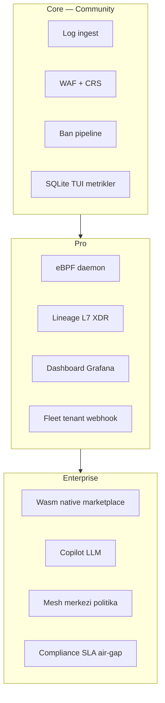

# Kapsam alanı — checklist ve sprint planı

**Amaç:** Linux Log Guardian'ın tüm kapsam alanlarını tek yerde takip etmek — log analizi + riskli IP ban (Core) ile Pro/Enterprise katmanları.

**İlgili belgeler:** [CUSTOMER_REQUIREMENTS.md](CUSTOMER_REQUIREMENTS.md) · [PROD_ROADMAP.md](PROD_ROADMAP.md) · [Log_Guardian_Enterprise_Roadmap.md](Log_Guardian_Enterprise_Roadmap.md) · [TEST_MATRIX.md](TEST_MATRIX.md)

**Son güncelleme:** 2026-06-09

---

## Faz ↔ Sprint eşlemesi (tek takip tablosu)

| Faz | Teknik alan | Doğrulama script | Sprint | Sprint hedefi | Çıkış kriteri |
|-----|-------------|------------------|--------|---------------|---------------|
| **0** | Güvenilirlik, kurulum | `phase0_e2e.sh` | **1** | Core prod | systemd + `--health` + nginx ban |
| **1** | WAF + OpenAPI/CRS | `phase1_e2e.sh` | **1** | Core prod | CRS alarm + FP smoke |
| **2** | XDR / lineage / incident | `phase2_caps_e2e.sh` | **2** | eBPF canlı | daemon + `prod_stack_e2e.sh` |
| **3** | API yüzeyi + K8s | `phase3_e2e.sh` | **2** | eBPF canlı | GraphQL + OpenAPI strict |
| **4** | Fleet + Grafana | `phase4_e2e.sh` | **3** | SOC | dashboard `/fleet` Online |
| **5** | Wasm + Copilot + mesh | `phase5_e2e.sh` | **5** | Wasm native + Pro | `wasm_release.sh` native |
| **6** | Rekabet kanıtı | `competitive_suite.sh` | **4** | Kalite | FP < %5, bench, CI gate |
| **D** | VM/VPS sunum kapısı | `vm_demo_gate.sh` | **4** | Prod kanıt | `post_install_verify` **0 FAIL** + webhook prod E2E |
| — | Güvenlik sertleştirme | `security_hardening_test.sh` | **4** | Kalite | IPC token, JWT |
| — | 72h soak | `soak_test.sh` | **6** | Enterprise backlog | 72h rapor |
| — | Enterprise tier | tier middleware | **6** | Enterprise backlog | imzalı plugin tasarımı |

**Tek komut (Faz 0–6):** `bash scripts/phase100.sh`  
**Data room / Sprint A:** `bash scripts/sprint_a.sh` → [DATA_ROOM.md](DATA_ROOM.md) · [SPRINT_GOALS.md](SPRINT_GOALS.md)  
**Tam paket:** `bash scripts/phase_complete.sh`

**Sprint sırası ≠ Faz sırası:** Sprint 4 (kalite/Faz 6) Sprint 5'ten (Wasm/Faz 5) önce gelir — önce kanıt kapıları, sonra Enterprise demo.

---

## Durum kodları

| Kod | Anlam |
|-----|--------|
| ✅ | Prod-ready veya E2E kapısı geçiyor |
| 🟡 | Kod var; stub/demo veya ortam bağımlı (daemon, dashboard, NIC) |
| 🔴 | Planlı / henüz birinci sınıf destek yok |
| ⏭ | İsteğe bağlı tier; Core vaadi için zorunlu değil |

**Tamamlanma tanımı (her satır için):**

1. Derleme + ilgili E2E script geçer
2. Prod ortamında canlı doğrulanır (systemd, gerçek NIC, dashboard açık vb.)
3. Kanıt artefaktı üretilir (JSON rapor, PDF, metrik)

---

## 1. Katman haritası



---

## 2. Master checklist (tüm alanlar)

### 2.1 Core — log → analiz → kernel ban

| # | Alan | Modül / dosya | Durum | Doğrulama | Not |
|---|------|---------------|-------|-----------|-----|
| C1 | nginx access log parse | `parser.c`, `examples/nginx-log-guardian.conf` | ✅ | `./log-guardian test_access.log --no-tui --json` | Birincil log kaynağı |
| C2 | WAF + CRS kuralları | `waf_rules.c`, `rules/crs-*.rules` | ✅ | `bash scripts/phase1_e2e.sh` | |
| C3 | Ban pipeline (IPC) | `ban_pipeline.c`, `daemon_ipc.c` | ✅ | `sudo log-guardian ban IP --reason test` | |
| C4 | Kernel ban (ipset/XDP) | `firewall.c`, `xdp_filter.c` | 🟡 | Prod NIC: `sudo log-guardian-daemon --iface eth0` | Dev Wi‑Fi: XDP OFF, ipset fallback |
| C5 | SQLite olay DB + TUI | `db.c`, `tui.c` | ✅ | `./log-guardian --status --db events.db` | |
| C6 | Prometheus metrikler | `metrics.c`, port 9091 | ✅ | `curl -s http://127.0.0.1:9091/metrics \| head` | Prefix: `loganalyzer_*` |
| C7 | Kurulum + systemd | `install.sh`, unit dosyaları | ✅ | `sudo log-guardian --health` | |
| C8 | OpenAPI / BOLA strict | `schema_validator.c` | ✅ | `bash scripts/bola_idor_e2e.sh` | Şema açıkken |
| C9 | **ssh / auth / journald log** | `parser.c`, `test_auth.log` | 🟡 | `bash scripts/auth_log_e2e.sh` | sshd satirlari; journald spike sonraki |
| C10 | **ARM / embedded Linux** | — | 🔴 | — | Yalnızca x86_64 hedefleniyor |

### 2.2 Pro — SOC, eBPF, filo

| # | Alan | Modül / dosya | Durum | Doğrulama | Not |
|---|------|---------------|-------|-----------|-----|
| P1 | eBPF daemon | `ebpf_daemon.c` | 🟡 | `sudo log-guardian-daemon --iface eth0` | Root + uygun kernel |
| P2 | execve / RCE probe | `syscall_uprobe.c` | 🟡 | `bash scripts/incident_e2e.sh` | |
| P3 | Lineage (openat/connect) | `lineage_probe.c`, `attack_tree.c` | 🟡 | `./log-guardian lineage-stats --demo` veya canlı daemon | Demo vs `data_mode: live` |
| P4 | L7 HTTP probe | `http_l7_probe.c`, `l7_telemetry.c` | 🟡 | `--status` → `l7_http`, `probe_active=true` | Daemon gerekli |
| P5 | Incident korelasyon | `incident_engine.c` | ✅ | `bash scripts/incident_e2e.sh` | |
| P6 | Falco host eşleme | `falco_host_rules.c` | ✅ | `bash scripts/falco_host_e2e.sh` | |
| P7 | Dashboard (Next.js) | `dashboard/` | 🟡 | `cd dashboard && npm run dev` | Prod: TLS + JWT |
| P8 | Fleet telemetry + komut | `agent_sync.c`, `/fleet` | 🟡 | `bash scripts/fleet_e2e.sh` | Dashboard + `SAAS_ENABLED=1` |
| P9 | Grafana panelleri | `grafana-dashboard.json`, `grafana-alerts.json` | ✅ | `bash scripts/grafana_provision.sh` | `$tenant` label |
| P10 | Webhook + Telegram ops | `webhook.c` | ✅ | laptop: tunnel setWebhook + `grafana_alert_e2e.sh` | [WEBHOOK_SETUP.md](WEBHOOK_SETUP.md) |
| P11 | Threat feed (AbuseIPDB/OTX) | `threat_feed.c` | ✅ | `bash scripts/threat_feed_live_proof.sh` | `--status` → `threat_feed_stats.json` |
| P12 | K8s operator | `k8s-operator/main.go` | 🟡 | `helm install lg ./helm/log-guardian` | |
| P13 | TLS prod stack | `docker-compose.prod.yml` | 🟡 | [TLS_PRODUCTION.md](TLS_PRODUCTION.md) | Caddy |

### 2.3 Enterprise — ekosistem ve SLA

| # | Alan | Modül / dosya | Durum | Doğrulama | Not |
|---|------|---------------|-------|-----------|-----|
| E1 | Wasm runtime (stub) | `wasm_runtime.c` | ✅ | `bash scripts/phase5_e2e.sh` | Kapı testi |
| E2 | Wasm **native** prod | Wasmtime + plugin build | 🟡 | `bash scripts/wasm_release.sh` | [WASM_PROD_CHECKLIST.md](WASM_PROD_CHECKLIST.md) |
| E3 | İmzalı marketplace API | dashboard tier middleware | 🔴 | `LOG_GUARDIAN_TIER=enterprise` | |
| E4 | Copilot (kural tabanlı) | `dashboard/src/app/copilot/` | ✅ | `/copilot` Ollama olmadan | |
| E5 | Copilot LLM (Ollama) | Copilot API | ⏭ | [COPILOT_LLM.md](COPILOT_LLM.md) | |
| E6 | Mesh (etcd) | `etcd_mesh.c`, `mesh_intel.c` | 🟡 | `MESH_BACKEND=etcd` | ZMQ opsiyonel |
| E7 | Compliance PDF export | dashboard Pro tier | 🟡 | Pro tier 403/200 gate | |
| E8 | 72h soak / air-gap runbook | `scripts/soak_test.sh` | 🟡 | [SOAK_TEST.md](SOAK_TEST.md) | |
| E9 | Enterprise destek süreci | [ENTERPRISE_SUPPORT.md](ENTERPRISE_SUPPORT.md) | 🟡 | Dokümantasyon | |

### 2.4 Kalite ve rekabet kapıları (tüm tier'lar)

| # | Alan | Durum | Doğrulama | Hedef |
|---|------|-------|-----------|-------|
| Q1 | Faz 0–5 dosya + E2E gate | ✅ | `bash scripts/phase_gate.sh` | PASSED |
| Q2 | Faz 0–6 tam paket | ✅ | `PHASE100_FAST=1 bash scripts/phase100.sh` | Tam: `phase100.sh` |
| Q3 | False positive oranı | 🟡 | `bash scripts/fp_report.sh` | benign fp_rate < %5 |
| Q4 | Throughput bench | ✅ | `bash scripts/bench_report.sh` | EPS + µs/satır |
| Q5 | Competitive merge gate | 🟡 | `bash scripts/competitive_gate.sh` | CI blocker |
| Q6 | Prod stack (Wasm+lineage+L7) | 🟡 | `bash scripts/prod_stack_e2e.sh` | Tek komut |
| Q7 | Güvenlik sertleştirme | ✅ | `bash scripts/security_hardening_test.sh` | IPC token, XFF, Wasm sandbox |
| Q8 | BOLA/IDOR E2E | ✅ | `bash scripts/bola_idor_e2e.sh` | idor_score ≥ 80 |

---

## 3. Faz bazlı özet (phase100)

| Faz | Kapsam | Kod kapısı | Prod kanıt |
|-----|--------|------------|------------|
| 0 | Güvenilirlik, kurulum | ✅ | 🟡 soak / 7×24 |
| 1 | WAF, CRS, ban | ✅ | ✅ nginx PoC |
| 2 | XDR, lineage, incident | ✅ | 🟡 canlı daemon |
| 3 | API, GraphQL, K8s | ✅ | 🟡 operator deploy |
| 4 | Fleet, Grafana | ✅ | 🟡 dashboard sürekli açık |
| 5 | Wasm, Copilot, mesh | ✅ | 🟡 Wasm native |
| 6 | Rekabet suite | 🟡 | bench + FP raporu |

**Tek komut (geliştirici):**

```bash
export LOGANALYZER_PASSWORD='DegistirBeni!123'
bash scripts/phase100.sh
```

---

## 4. Sprint planı (6 hafta)

Her sprint sonunda ilgili satırlar ✅ olmalı; ara doğrulama komutları sprint notlarında.

### Sprint 1 — Core prod (Hafta 1)

**Hedef:** Tek Ubuntu sunucuda 15 dk nginx koruması, ban gerçekten çalışıyor.

| Görev | Checklist | Çıkış kriteri |
|-------|-----------|---------------|
| Temiz kurulum | C1–C7 | `sudo log-guardian --health` yeşil |
| nginx log format | C1 | `examples/nginx-log-guardian.conf` aktif |
| Daemon + ban | C3, C4 | Sentetik saldırı → ipset'te IP |
| systemd enable | C7 | reboot sonrası servis ayakta |
| FP smoke | Q3 | `fp_report.sh` fp_rate < %5 |

```bash
sudo bash install.sh
sudo systemctl enable --now log-guardian-daemon log-guardian
./log-guardian test_access.log --no-tui --json --rules test_rules.conf
sudo log-guardian --status | jq .
bash scripts/fp_report.sh
```

### Sprint 2 — eBPF canlı mod (Hafta 2)

**Hedef:** Stub/demo değil; lineage + L7 + XDP prod NIC'te.

| Görev | Checklist | Çıkış kriteri |
|-------|-----------|---------------|
| Daemon prod NIC | C4, P1 | XDP attach veya ipset fallback dokümante |
| Lineage live | P3 | `attack-tree` → `data_mode: live` |
| L7 probe | P4 | `--status` → `probe_active: true` |
| Incident E2E | P5 | `incident_e2e.sh` OK |
| Prod stack | Q6 | `prod_stack_e2e.sh` OK |

```bash
sudo log-guardian-daemon --iface eth0   # gerçek NIC adı
curl -s http://127.0.0.1:8080/api/v1/attack-tree | jq .data_mode
bash scripts/prod_stack_e2e.sh
```

### Sprint 3 — SOC katmanı (Hafta 3)

**Hedef:** Dashboard + fleet + Grafana operatör akışı.

| Görev | Checklist | Çıkış kriteri |
|-------|-----------|---------------|
| Dashboard dev/prod | P7 | login + JWT prod mod |
| Fleet online | P8 | `/fleet` agent Online ≤15 sn |
| Grafana | P9 | tenant panel `$tenant` |
| TLS (opsiyonel) | P13 | `docker-compose.prod.yml` up |

```bash
cd dashboard && npx prisma db push && node prisma/seed.mjs && npm run dev
# rules.conf: SAAS_ENABLED=1, SAAS_TOKEN, AGENT_ID
bash scripts/fleet_e2e.sh
bash scripts/grafana_provision.sh
```

Detay: [FLEET_ONLINE.md](FLEET_ONLINE.md), [GRAFANA_SETUP.md](GRAFANA_SETUP.md)

### Sprint 4 — Kalite kapıları (Hafta 4)

**Hedef:** Rekabet kanıtı ve güvenlik sertleştirme merge-ready.

| Görev | Checklist | Çıkış kriteri |
|-------|-----------|---------------|
| Competitive suite | Q2, Q4, Q5 | `competitive_suite.sh` artefaktlar |
| Security hardening | Q7 | IPC token, rate limit |
| BOLA/IDOR | C8, Q8 | `bola_idor_e2e.sh` OK |
| CI gate | Q5 | `.github/workflows/build.yml` yeşil |

```bash
bash scripts/competitive_suite.sh
bash scripts/security_hardening_test.sh
bash scripts/competitive_gate.sh
```

### Sprint 5 — Wasm native + Pro tier (Hafta 5)

**Hedef:** Enterprise öncesi Wasm prod; Pro tier demo hazır.

| Görev | Checklist | Çıkış kriteri |
|-------|-----------|---------------|
| Wasm native build | E2 | `wasm-status.json` mode=native, pass=true |
| Hot-plug plugin | E2 | inotify reload |
| Pro tier gate | P8, E7 | `LOG_GUARDIAN_TIER=pro` fleet+export |
| Webhook dry-run | P10 | alarm fan-out test |

```bash
bash scripts/build_wasm_plugin.sh
bash scripts/wasm_release.sh
cat wasm-status.json
```

Detay: [WASM_PROD_CHECKLIST.md](WASM_PROD_CHECKLIST.md)

### Sprint 6 — Enterprise hazırlık + genişleme backlog (Hafta 6)

**Hedef:** Uzun vadeli alanlar için net backlog; soak başlat.

| Görev | Checklist | Çıkış kriteri |
|-------|-----------|---------------|
| 72h soak başlat | E8 | `soak_test.sh` arka planda |
| Mesh etcd | E6 | filo politika push |
| Copilot LLM (opsiyonel) | E5 | Ollama veya fallback dokümante |
| **Backlog:** auth/ssh log | C9 | RFC veya parser spike |
| Enterprise tier dok | E3, E9 | imzalı plugin tasarım notu |

```bash
bash scripts/soak_test.sh &
bash scripts/phase100.sh   # final gate
```

---

## 5. Haftalık ritim (operasyon)

| Gün | Aktivite |
|-----|----------|
| Pazartesi | Sprint görevleri + `make -j$(nproc)` |
| Çarşamba | İlgili `phase*_e2e.sh` veya alt script |
| Cuma | Checklist satırlarını güncelle; `--status` + metrik snapshot |
| Sprint sonu | `phase100.sh` veya `competitive_suite.sh` |

**Ortam değişkeni (tüm testler):**

```bash
export LOGANALYZER_PASSWORD='DegistirBeni!123'
```

---

## 6. Bilinen boşluklar (öncelik sırası)

1. **nginx dışı log kaynakları** (ssh, auth, journald) — Core mesajını genişletmek için C9
2. **Wasm stub → native** — prod yayın öncesi zorunlu (E2)
3. **Fleet/dashboard sürekli telemetry** — Pro demo için P8
4. **XDP prod NIC** — gerçek ban performansı C4
5. **FP tuning** — benign corpus kuralları Q3
6. **Enterprise imzalı marketplace** — E3 uzun vadeli

---

## 7. Hızlı referans — tek satır komutlar

| Amaç | Komut |
|------|--------|
| Tüm faz kapısı | `bash scripts/phase100.sh` |
| Dosya + derleme gate | `bash scripts/phase_gate.sh` |
| Prod stack | `bash scripts/prod_stack_e2e.sh` |
| Rekabet paketi | `bash scripts/competitive_suite.sh` |
| Sağlık | `sudo log-guardian --health` |
| Operatör durumu | `sudo log-guardian --status` |
| nginx quickstart | [QUICKSTART_NGINX.md](QUICKSTART_NGINX.md) |

---

## 8. Checklist güncelleme

Bu belgedeki durum sütununu güncellerken:

1. İlgili E2E script çıktısını kaydet (`*.json`, `fp-report.txt`)
2. Prod ortam notunu ekle (NIC adı, kernel, dashboard URL)
3. `Son güncelleme` tarihini değiştir

**Tam kapsam tanımı:** Core (C1–C8) prod ✅ + Pro (P1–P9) canlı demo ✅ + Q1–Q8 kalite kapıları ✅ + Enterprise (E1–E2) Wasm native ✅.
