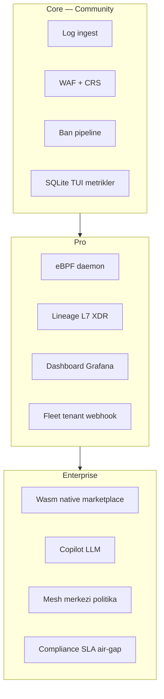

# Kapsam alanı — checklist ve sprint planı

**Amaç:** Linux Log Guardian'ın tüm kapsam alanlarını tek yerde takip etmek — log analizi + riskli IP ban (Core) ile Pro/Enterprise katmanları.

**İlgili belgeler:** [CUSTOMER_REQUIREMENTS.md](CUSTOMER_REQUIREMENTS.md) · [PROD_ROADMAP.md](PROD_ROADMAP.md) · [Log_Guardian_Enterprise_Roadmap.md](Log_Guardian_Enterprise_Roadmap.md) · [TEST_MATRIX.md](TEST_MATRIX.md)

**Son güncelleme:** 2026-07-08 (Sprint 8; laptop + canlı site `/tests` **85 kart**; P4 VPS bekliyor)

---

## Faz ↔ Sprint eşlemesi (tek takip tablosu)

| Faz | Teknik alan | Doğrulama script | Sprint | Sprint hedefi | Çıkış kriteri |
|-----|-------------|------------------|--------|---------------|---------------|
| **0** | Güvenilirlik, kurulum | `phase0_e2e.sh` | **1** | Core prod | systemd + `--health` + nginx ban |
| **1** | WAF + OpenAPI/CRS | `phase1_e2e.sh` | **1** | Core prod | CRS alarm + FP smoke |
| **2** | XDR / lineage / incident | `phase2_caps_e2e.sh` | **2** | eBPF canlı | daemon + `prod_stack_e2e.sh` |
| **3** | API yüzeyi + K8s | `phase3_e2e.sh` | **2** | eBPF canlı | GraphQL + OpenAPI strict |
| **4** | Fleet + Grafana | `phase4_e2e.sh` | **3** | SOC | dashboard `/fleet` Online |
| **5** | Wasm + Copilot + mesh | `phase5_e2e.sh` | **5** | Wasm native + Pro | `wasm_release.sh` native |
| **6** | Rekabet kanıtı | `competitive_suite.sh` | **4** | Kalite | FP < %5, bench, CI gate |
| **D** | VM/VPS sunum kapısı | `vm_demo_gate.sh` | **4** | Prod kanıt | `post_install_verify` **0 FAIL** + webhook prod E2E |
| — | Güvenlik sertleştirme | `security_hardening_test.sh` | **4** | Kalite | IPC token, JWT |
| — | 72h soak | `soak_test.sh` | **6** | Enterprise backlog | 72h rapor |
| — | Enterprise tier | tier middleware | **6** | Enterprise backlog | imzalı plugin tasarımı |

**Tek komut (Faz 0–6):** `bash scripts/phase100.sh`  
**Data room / Sprint A:** `bash scripts/sprint_a.sh` → [DATA_ROOM.md](DATA_ROOM.md) · [SPRINT_GOALS.md](SPRINT_GOALS.md)  
**Tam paket:** `bash scripts/phase_complete.sh`

**Sprint sırası ≠ Faz sırası:** Sprint 4 (kalite/Faz 6) Sprint 5'ten (Wasm/Faz 5) önce gelir — önce kanıt kapıları, sonra Enterprise demo.

---

## Durum kodları

| Kod | Anlam |
|-----|--------|
| ✅ | Prod-ready veya E2E kapısı geçiyor |
| 🟡 | Kod var; stub/demo veya ortam bağımlı (daemon, dashboard, NIC) |
| 🔴 | Planlı / henüz birinci sınıf destek yok |
| ⏭ | İsteğe bağlı tier; Core vaadi için zorunlu değil |

**Tamamlanma tanımı (her satır için):**

1. Derleme + ilgili E2E script geçer
2. Prod ortamında canlı doğrulanır (systemd, gerçek NIC, dashboard açık vb.)
3. Kanıt artefaktı üretilir (JSON rapor, PDF, metrik)

---

## 1. Katman haritası



---

## 2. Master checklist (tüm alanlar)

### 2.1 Core — log → analiz → kernel ban

| # | Alan | Modül / dosya | Durum | Doğrulama | Not |
|---|------|---------------|-------|-----------|-----|
| C1 | nginx access log parse | `parser.c`, `examples/nginx-log-guardian.conf` | ✅ | `./log-guardian test_access.log --no-tui --json` | Birincil log kaynağı |
| C2 | WAF + CRS kuralları | `waf_rules.c`, `rules/crs-*.rules` | ✅ | `bash scripts/phase1_e2e.sh` | |
| C3 | Ban pipeline (IPC) | `ban_pipeline.c`, `daemon_ipc.c` | ✅ | `sudo log-guardian ban IP --reason test` | |
| C4 | Kernel ban (ipset/XDP) | `firewall.c`, `xdp_filter.c` | ✅ laptop | `ipset` ban + `vps-xdp` skip ⚠ | VPS `eth0` → kernel-XDP |
| C5 | SQLite olay DB + TUI | `db.c`, `tui.c` | ✅ | `./log-guardian --status --db events.db` | |
| C6 | Prometheus metrikler | `metrics.c`, port 9091 | ✅ | `curl -s http://127.0.0.1:9091/metrics \| head` | Prefix: `loganalyzer_*` |
| C7 | Kurulum + systemd | `install.sh`, unit dosyaları | ✅ | `sudo log-guardian --health` | |
| C8 | OpenAPI / BOLA strict | `schema_validator.c` | ✅ | `bash scripts/bola_idor_e2e.sh` | Şema açıkken |
| C9 | **ssh / auth / journald log** | `parser.c`, `test_auth.log`, `tests/fixtures/` | ✅ | `bash scripts/auth_log_e2e.sh` · `bash scripts/journald_e2e.sh` | journald usec + sudo rhost |
| C10 | **ARM / embedded Linux** | `Makefile`, `scripts/build_arm64.sh` | ✅ | `bash scripts/build_arm64.sh` | Laptop: cross-gnu aarch64 |

### 2.2 Pro — SOC, eBPF, filo

| # | Alan | Modül / dosya | Durum | Doğrulama | Not |
|---|------|---------------|-------|-----------|-----|
| P1 | eBPF daemon | `ebpf_daemon.c` | ✅ laptop | `log-guardian-daemon` active, ipset-fallback | VPS NIC: `--iface eth0` |
| P2 | execve / RCE probe | `syscall_uprobe.c` | ✅ | `bash scripts/incident_e2e.sh` | |
| P3 | Lineage (openat/connect) | `lineage_probe.c`, `attack_tree.c` | ✅ | `lineage-live-report.json` + dashboard CANLI | `data_mode: live` |
| P4 | L7 HTTP probe | `http_l7_probe.c`, `l7_telemetry.c` | ✅ | `l7-probe-prod-report.json`, `probe_active=true` | ipset-fallback laptop |
| P5 | Incident korelasyon | `incident_engine.c` | ✅ | `bash scripts/incident_e2e.sh` | |
| P6 | Falco host eşleme | `falco_host_rules.c` | ✅ | `bash scripts/falco_host_e2e.sh` | |
| P7 | Dashboard (Next.js) | `dashboard/` | ✅ | `https://localhost:8443` + `/tests` **85 kart** | Prod: Caddy TLS + JWT |
| P8 | Fleet telemetry + komut | `agent_sync.c`, `/fleet` | ✅ | `fleet_multi_node_e2e.sh` + VM `node-vm-02` keepalive | Dashboard :8443; 2 node canlı demo |
| P9 | Grafana panelleri | `grafana-dashboard.json`, `grafana-alerts.json` | ✅ | `bash scripts/grafana_provision.sh` | `$tenant` label |
| P10 | Webhook + Telegram ops | `webhook.c` | ✅ | laptop: tunnel setWebhook + `grafana_alert_e2e.sh` | [WEBHOOK_SETUP.md](WEBHOOK_SETUP.md) |
| P11 | Threat feed (AbuseIPDB/OTX) | `threat_feed.c` | ✅ | `bash scripts/threat_feed_live_proof.sh` | `--status` → `threat_feed_stats.json` |
| P12 | K8s operator | `k8s-operator/main.go` | ✅ lab | `helm_install_smoke.sh` + [K8S_KIND_QUICKSTART.md](K8S_KIND_QUICKSTART.md) | Gerçek cluster deploy opsiyonel |
| P13 | TLS prod stack | `docker-compose.prod.yml` | ✅ laptop | `https://localhost:8443` Caddy | Müşteri domain ayrı |

### 2.3 Enterprise — ekosistem ve SLA

| # | Alan | Modül / dosya | Durum | Doğrulama | Not |
|---|------|---------------|-------|-----------|-----|
| E1 | Wasm runtime (stub) | `wasm_runtime.c` | ✅ | `bash scripts/phase5_e2e.sh` | Kapı testi |
| E2 | Wasm **native** prod | Wasmtime + plugin build | ✅ | `bash scripts/wasm_release.sh` | [WASM_PROD_CHECKLIST.md](WASM_PROD_CHECKLIST.md) |
| E3 | İmzalı marketplace API | dashboard tier middleware | ✅ | `LOG_GUARDIAN_TIER=enterprise` | `marketplace_signed_api_e2e.sh` |
| E4 | Copilot (kural tabanlı) | `dashboard/src/app/copilot/` | ✅ | `/copilot` Ollama olmadan | |
| E5 | Copilot LLM (Ollama) | Copilot API | ✅ laptop | `copilot_ollama_e2e.sh` | Opsiyonel tier; fallback zorunlu değil |
| E6 | Mesh (etcd) | `etcd_mesh.c`, `mesh_intel.c` | ✅ | `mesh_etcd_e2e.sh` + `mesh_etcd_live_e2e.sh` | Laptop docker PUT/GET; VPS cluster opsiyonel |
| E7 | Compliance PDF export | dashboard Pro tier | ✅ | `bash scripts/compliance_export_e2e.sh` | `/api/reports/export` Pro gate |
| E8 | 72h soak / air-gap runbook | `scripts/soak_test.sh` | ✅ | `soak-report.json` 864 örnek, 0 fail (2026-06-16→19) | Laptop kanıt; VPS tekrar opsiyonel |
| E9 | Enterprise destek süreci | [ENTERPRISE_SUPPORT.md](ENTERPRISE_SUPPORT.md) · [ENTERPRISE_ESCALATION.md](ENTERPRISE_ESCALATION.md) | ✅ | Dokümantasyon + SLA + escalation | 85 test vitrin |

### 2.4 Kalite ve rekabet kapıları (tüm tier'lar)

| # | Alan | Durum | Doğrulama | Hedef |
|---|------|-------|-----------|-------|
| Q1 | Faz 0–5 dosya + E2E gate | ✅ | `bash scripts/phase_gate.sh` | PASSED |
| Q2 | Faz 0–6 tam paket | ✅ | `PHASE100_FAST=1 bash scripts/phase100.sh` | Tam: `phase100.sh` |
| Q3 | False positive oranı | ✅ | `bash scripts/fp_report.sh` | benign fp_rate 0.2% (< %5) |
| Q4 | Throughput bench | ✅ | `bash scripts/bench_report.sh` | EPS + µs/satır |
| Q5 | Competitive merge gate | ✅ | `bash scripts/competitive_gate.sh` | CI blocker |
| Q6 | Prod stack (Wasm+lineage+L7) | ✅ | `bash scripts/prod_stack_e2e.sh` | Tek komut |
| Q7 | Güvenlik sertleştirme | ✅ | `bash scripts/security_hardening_test.sh` | IPC token, XFF, Wasm sandbox |
| Q8 | BOLA/IDOR E2E | ✅ | `bash scripts/bola_idor_e2e.sh` | idor_score ≥ 80 |

---

## 3. Faz bazlı özet (phase100)

| Faz | Kapsam | Kod kapısı | Prod kanıt |
|-----|--------|------------|------------|
| 0 | Güvenilirlik, kurulum | ✅ | ✅ `post_install_verify` 0 FAIL |
| 1 | WAF, CRS, ban | ✅ | ✅ nginx + live harness |
| 2 | XDR, lineage, incident | ✅ | ✅ laptop live (`prod_stack_e2e`) |
| 3 | API, GraphQL, K8s | ✅ | ✅ API; K8s helm smoke |
| 4 | Fleet, Grafana | ✅ | ✅ 2 node + Grafana provision |
| 5 | Wasm, Copilot, mesh | ✅ | ✅ Wasm native + Ollama opsiyonel |
| 6 | Rekabet suite | ✅ | ✅ FP 0.2%, competitive_gate |

**Tek komut (geliştirici):**

```bash
export LOGANALYZER_PASSWORD='DegistirBeni!123'
bash scripts/phase100.sh
```

---

## 4. Sprint planı (6 hafta)

Her sprint sonunda ilgili satırlar ✅ olmalı; ara doğrulama komutları sprint notlarında.

### Sprint 1 — Core prod (Hafta 1)

**Hedef:** Tek Ubuntu sunucuda 15 dk nginx koruması, ban gerçekten çalışıyor.

| Görev | Checklist | Çıkış kriteri |
|-------|-----------|---------------|
| Temiz kurulum | C1–C7 | `sudo log-guardian --health` yeşil |
| nginx log format | C1 | `examples/nginx-log-guardian.conf` aktif |
| Daemon + ban | C3, C4 | Sentetik saldırı → ipset'te IP |
| systemd enable | C7 | reboot sonrası servis ayakta |
| FP smoke | Q3 | `fp_report.sh` fp_rate < %5 |

```bash
sudo bash install.sh
sudo systemctl enable --now log-guardian-daemon log-guardian
./log-guardian test_access.log --no-tui --json --rules test_rules.conf
sudo log-guardian --status | jq .
bash scripts/fp_report.sh
```

### Sprint 2 — eBPF canlı mod (Hafta 2)

**Hedef:** Stub/demo değil; lineage + L7 + XDP prod NIC'te.

| Görev | Checklist | Çıkış kriteri |
|-------|-----------|---------------|
| Daemon prod NIC | C4, P1 | XDP attach veya ipset fallback dokümante |
| Lineage live | P3 | `attack-tree` → `data_mode: live` |
| L7 probe | P4 | `--status` → `probe_active: true` |
| Incident E2E | P5 | `incident_e2e.sh` OK |
| Prod stack | Q6 | `prod_stack_e2e.sh` OK |

```bash
sudo log-guardian-daemon --iface eth0   # gerçek NIC adı
curl -s http://127.0.0.1:8080/api/v1/attack-tree | jq .data_mode
bash scripts/prod_stack_e2e.sh
```

### Sprint 3 — SOC katmanı (Hafta 3)

**Hedef:** Dashboard + fleet + Grafana operatör akışı.

| Görev | Checklist | Çıkış kriteri |
|-------|-----------|---------------|
| Dashboard dev/prod | P7 | login + JWT prod mod |
| Fleet online | P8 | `/fleet` agent Online ≤15 sn |
| Grafana | P9 | tenant panel `$tenant` |
| TLS (opsiyonel) | P13 | `docker-compose.prod.yml` up |

```bash
cd dashboard && npx prisma db push && node prisma/seed.mjs && npm run dev
# rules.conf: SAAS_ENABLED=1, SAAS_TOKEN, AGENT_ID
bash scripts/fleet_e2e.sh
bash scripts/grafana_provision.sh
```

Detay: [FLEET_ONLINE.md](FLEET_ONLINE.md), [GRAFANA_SETUP.md](GRAFANA_SETUP.md)

### Sprint 4 — Kalite kapıları (Hafta 4)

**Hedef:** Rekabet kanıtı ve güvenlik sertleştirme merge-ready.

| Görev | Checklist | Çıkış kriteri |
|-------|-----------|---------------|
| Competitive suite | Q2, Q4, Q5 | `competitive_suite.sh` artefaktlar |
| Security hardening | Q7 | IPC token, rate limit |
| BOLA/IDOR | C8, Q8 | `bola_idor_e2e.sh` OK |
| CI gate | Q5 | `.github/workflows/build.yml` yeşil |

```bash
bash scripts/competitive_suite.sh
bash scripts/security_hardening_test.sh
bash scripts/competitive_gate.sh
```

### Sprint 5 — Wasm native + Pro tier (Hafta 5)

**Hedef:** Enterprise öncesi Wasm prod; Pro tier demo hazır.

| Görev | Checklist | Çıkış kriteri |
|-------|-----------|---------------|
| Wasm native build | E2 | `wasm-status.json` mode=native, pass=true |
| Hot-plug plugin | E2 | inotify reload |
| Pro tier gate | P8, E7 | `LOG_GUARDIAN_TIER=pro` fleet+export |
| Webhook dry-run | P10 | alarm fan-out test |

```bash
bash scripts/build_wasm_plugin.sh
bash scripts/wasm_release.sh
cat wasm-status.json
```

Detay: [WASM_PROD_CHECKLIST.md](WASM_PROD_CHECKLIST.md)

### Sprint 6 — Enterprise hazırlık + genişleme backlog (Hafta 6)

**Hedef:** Uzun vadeli alanlar için net backlog; soak başlat.

| Görev | Checklist | Çıkış kriteri |
|-------|-----------|---------------|
| 72h soak başlat | E8 | `soak_test.sh` arka planda |
| Mesh etcd | E6 | filo politika push |
| Copilot LLM (opsiyonel) | E5 | Ollama veya fallback dokümante |
| **Backlog:** auth/ssh log | C9 | RFC veya parser spike |
| Enterprise tier dok | E3, E9 | imzalı plugin tasarım notu |

```bash
bash scripts/soak_test.sh &
bash scripts/phase100.sh   # final gate
```

---

## 5. Haftalık ritim (operasyon)

| Gün | Aktivite |
|-----|----------|
| Pazartesi | Sprint görevleri + `make -j$(nproc)` |
| Çarşamba | İlgili `phase*_e2e.sh` veya alt script |
| Cuma | Checklist satırlarını güncelle; `--status` + metrik snapshot |
| Sprint sonu | `phase100.sh` veya `competitive_suite.sh` |

**Ortam değişkeni (tüm testler):**

```bash
export LOGANALYZER_PASSWORD='DegistirBeni!123'
```

---

## Bilinen boşluklar (öncelik sırası)

### VPS olmadan (laptop — şimdi)

| Madde | Komut | Durum |
|-------|--------|--------|
| Enterprise SOAR operatör | `sudo bash scripts/enable_enterprise_soar_api.sh` | ✅ |
| Vitrin 85/85 | laptop + `ceniklinuxlogguardian.org/tests` | ✅ |
| E9 runbook zinciri | `bash scripts/enterprise_e9_verify.sh` | ✅ |
| Edge checklist | `bash scripts/edge_protection_checklist.sh` | ✅ |
| VPS hazırlık paketi | `bash scripts/vps_prep_gate.sh` | ✅ (sunucu yok) |
| PDF kanıt | `bash scripts/local_proof_refresh.sh` | opsiyonel |
| VM binary sync | `vm_sync_from_host.sh` → `vm_build_binary.sh` | C değişince |

### VPS gelince (ertelenen)

1. **XDP prod NIC (VPS)** — `sudo bash scripts/vps_xdp_proof.sh` (VPS_XDP_SKIP **yok**); laptop/VM skip bilinçli
2. **CDN origin real_ip** — Cloudflare proxied + `deploy/cloudflare-origin.conf` on VPS
3. **Mesh etcd VPS cluster** — laptop docker live-rw ✅; multi-node VPS opsiyonel
4. **72h soak VPS** — `install_soak_systemd.sh` (laptop soak ✅ zaten kapalı)

**Laptop mükemmellik kapısı:** `bash scripts/laptop_excellence_gate.sh` · reboot: `laptop_reboot_ready.sh`

**Kapalı (2026-06-29):** `.deb` + VM install ✅ · C9 auth/journald ✅ · E2 Wasm native ✅ · E5 Ollama ✅ · E7 compliance PDF ✅ · E8 72h soak ✅ · P8 filo multi-host (VM+host) ✅ · Q3 FP %0.2 ✅ · `phase100_fast_gate` ✅ · site/dashboard **57 test** ✅ · VM demo gate ✅ · attack map ✅ · k8s kind live-ready ✅ · Sprint O (fuzz/TAXII/lineage) ✅ · Sprint W (Telegram undo) ✅

---

## Sprint 7+ — öncelik backlog (işleyişi bozmadan)

**İlke:** Community/laptop profili değişmez · yeni davranış **opt-in** veya **gate script** · ban/WAF/nginx hattına dokunmayan maddeler önce.

| Kod | Anlam |
|-----|--------|
| 🔵 | Operasyon / kanıt — kod riski yok |
| 🟢 | Güvenlik derinliği — opt-in veya VPS-only |
| 🟣 | Dağıtım / UX — geriye uyumlu |
| ⏸️ | VPS veya harici bağımlılık |

### P0 — Bu gece / sabah (≤2 saat, sıfır regresyon)

| # | Madde | Kod | Komut / çıkış | Kırılma riski |
|---|--------|-----|---------------|---------------|
| 1 | **Sabah operatör zinciri** tek rutin | 🔵 | `morning_operator_gate.sh` → `enterprise_e9_verify.sh` → `quick_proof_refresh.sh` | Yok |
| 2 | Kanıt JSON yaş kontrolü (bayat rapor uyarısı) | 🔵 | `morning_operator_gate.sh` içine mtime check veya ayrı `proof_freshness_check.sh` | Yok |
| 3 | Fleet pending komut temizliği | 🔵 | `fleet_prune_pending_commands.sh` — haftalık / demo öncesi | Yok |
| 4 | `active_bans.json` stale onarımı | 🔵 | `repair_active_bans_json.sh` — dashboard attack map | Yok |
| 5 | Operator secret yedeği (hardening öncesi) | 🔵 | `backup_operator_secrets.sh` | Yok |
| 6 | Dashboard kanıt sync + hard refresh hatırlatması | 🔵 | `sync_dashboard_data.sh` + `dashboard_refresh.sh` | Yok |
| 7 | Edge checklist taze koşu | 🔵 | `edge_protection_checklist.sh` → `edge-protection-checklist-report.json` | Yok |

### P1 — Hafta 1 (güvenlik derinliği, opt-in)

| # | Madde | Kod | Komut / çıkış | Kırılma riski |
|---|--------|-----|---------------|---------------|
| 8 | Mutation token tam kapatma | 🟢 | `ensure_api_split_tokens.sh` + `api_mutation_token_e2e.sh` + `ban_api_mtls_e2e.sh` | Community: strict kapalı = eski davranış |
| 9 | SOAR gate sentezi (Enterprise profil) | 🟢 | `enterprise_soar_gate.sh` — `REQUIRE_SOAR=0` default | Kapalıyken skip |
| 10 | mTLS operasyon runbook | 🟢 | Sertifika rotasyon + `caddy_mtls_status_export.sh` süre uyarısı doc | Lab-only |
| 11 | Ban mutasyon audit trail | 🟢 | `events.db` append-only satır; API sözleşmesi aynı | Yok |
| 12 | Haftalık güvenlik audit cron | 🟢 | `install_audit_cron.sh` → `local_security_audit.sh` | Laptop WARN kalır |
| 13 | Push öncesi secret scan | 🟢 | `pre_push_secret_scan.sh` — GitHub ship öncesi zorunlu | Yok |
| 14 | Internet-facing zincir dokümantasyonu | 🟢 | `laptop_harden.sh` → `apply_internet_facing_hardening.sh` → `security_closure_gate.sh` tek sıra | VPS-only uygulama |
| 15 | `ban-db-prune` cron (intel TTL) | 🟢 | `edge_protection_checklist` warn → `sudoers-ban-db-prune.example` | ipset/DB sadece eski satır |

### P2 — Hafta 2 (operatör UX + dayanıklılık)

| # | Madde | Kod | Komut / çıkış | Kırılma riski |
|---|--------|-----|---------------|---------------|
| 16 | Dashboard ban onay diyaloğu (yanlış ban) | 🟣 | `/bans` — FP whitelist uyarısı | UX only |
| 17 | BanApiOpsPanel — mutation/mTLS durum vitrin | 🟣 | `/api/ban-api-status` + `BanApiOpsPanel.tsx` | Read-only panel |
| 18 | JWT idle timeout (dashboard) | 🟣 | Oturum süresi env; demo profil uzun kalabilir | Opt-in env |
| 19 | `rules.conf` dry-run doğrulama | 🟣 | `log-guardian --validate-rules` veya mevcut `--health` genişletme | Read-only |
| 20 | Docker Compose healthcheck'ler | 🟣 | `docker-compose.prod.yml` — Caddy/dashboard restart policy | Yok |
| 21 | Webhook fail metrik reset ritmi | 🔵 | `webhook_metrics_reset.sh` — Grafana stale alarm | Yok |
| 22 | Fleet heartbeat uyarısı (Grafana) | 🟣 | `loganalyzer_fleet_agent_*` + `lg-fleet-offline` + `fleet_offline_gate.sh` | Metrik + gate |
| 23 | Hardening geri alma notu | 🟢 | `apply_internet_facing_hardening` env yedeği + rollback adımları | Doc only |
| 24 | OWASP corpus +1 kategori / sprint | 🟣 | `corpus/` genişletme — mevcut %100 korunur | Yok |

### P3 — Hafta 3–4 (dağıtım + Enterprise paket)

| # | Madde | Kod | Komut / çıkış | Kırılma riski |
|---|--------|-----|---------------|---------------|
| 25 | `.deb` build + smoke | 🟣 | `install.sh` ile aynı akış; `post_install_verify` 0 FAIL | Paralel kanal |
| 26 | K8s operator net durum | 🟣 | `helm_install_smoke.sh` ✅ + kind tek sayfa rehber | Cluster opsiyonel |
| 27 | `enterprise_e9_verify` → sabah gate opsiyonel hook | 🔵 | `SKIP_MORNING=1` korunur | Yok |
| 28 | Evidence pack otomatik sync | 🔵 | `sync_evidence_pack.sh` cron veya sprint sonu | Yok |
| 29 | Dashboard `npm audit` + pin | 🟢 | `dashboard/package-lock.json` — supply chain | Build only |
| 30 | SQLite `events.db` bakım cron | 🔵 | VACUUM/pragma — TUI/rapor performansı | Arka plan |

### P4 — VPS gelince (hazırlık tamam, sunucu şart)

| # | Madde | Kod | Komut | Not |
|---|--------|-----|-------|-----|
| 31 | Kernel XDP `eth0` | ⏸️ | `vps_xdp_proof.sh` | Laptop skip bilinçli |
| 32 | Cloudflare origin + `TRUST_XFF=0` | ⏸️ | `deploy/cloudflare-origin.conf` | |
| 33 | Internet-facing tam zincir | 🟢 | P1 #14 komut sırası canlı | `detect_internet_facing` |
| 34 | 72h soak VPS tekrarı | ⏸️ | `install_soak_systemd.sh` | Laptop 72h ✅ — tekrar önerilmez |
| 35 | Mesh etcd multi-node VPS | ⏸️ | `mesh_etcd_live_e2e.sh` | Laptop docker yeterli demo |

### Bilinçli yapılmayacaklar (regresyon / kapsam)

- Core mimariyi inline ModSec'e çevirmek (log-tailing vaadi)
- Community demo parolayı kaldırmak (`DegistirBeni!123` bilinçli)
- `API_BIND` varsayılanını `0.0.0.0` yapmak
- 72h soak'ı laptop'ta yeniden koşturmak
- Tek token modelini Community'de zorunlu kılmak (mutation strict = Enterprise)

### Tek komut — sabah operatör (P0)

```bash
bash scripts/morning_operator_chain.sh
# Hizli: SKIP_DASHBOARD_REFRESH=1 bash scripts/morning_operator_chain.sh
```

### Haftalık — kanıt tazeliği (Plan A2)

```bash
bash scripts/weekly_operator_ritual.sh
# Cron: bash scripts/install_weekly_operator_cron.sh
# Filo prune cron: bash scripts/install_fleet_prune_cron.sh
```

### Sprint 7+ tamamlanma özeti (2026-07-08 — laptop bugün)

| # alan | Durum | Kanıt / komut |
|--------|--------|----------------|
| **A1** sabah ritmi | ✅ | `morning_operator_chain.sh` · 85/85 |
| **A2** kanıt tazeliği | ✅ | `weekly_operator_ritual` + Cuma cron · `proof_freshness` |
| **A3** fleet prune | ✅ | FLEET_ONLINE §5 + Pazar cron |
| **A4** K8s | ✅ | kind rehber + helm smoke · P12 lab |
| **A5** .deb | ✅ | `test_deb_local.sh` |
| **B1** mutation token | ✅ | `api_mutation_token_e2e` + mtls e2e |
| **B2** mTLS ops | ✅ | rotasyon runbook + expiry cron |
| **B3** internet-facing zincir | ✅ doc / ⏸️ VPS uygula | `INTERNET_FACING_SECURITY_CHAIN.md` |
| **B4** secret/audit | ✅ | `pre_push` FAIL:0 · audit cron |
| **B5** ban audit trail | ✅ | `/var/lib/.../api-mutation-audit.jsonl` · e2e |
| **B6** dashboard güvenlik | ✅ | ban confirm · JWT idle env · BanApiOps · internet-facing demo parola FAIL |
| **B7 / P4** edge XDP CF | ⏸️ | `vps_prep_gate` hazır |
| **P0** 1–7 | ✅ | zincir koşuldu |
| **P1** 8–15 | ✅ | split, SOAR, cronlar, prune |
| **P2** 16–24 | ✅ | UX + validate_rules + healthcheck + corpus 31 kat. · `fleet_offline_gate` + **Grafana `lg-fleet-offline`** (agent gauge) |
| **P3** 25–30 | ✅ | deb · kind · E9 hook · evidence 10:15 · events VACUUM · npm overrides postcss |
| **Canlı site** | ✅ | `website_live_gate` 85 kart |
| **Kapanış koşusu** | ✅ | `grafana_provision` 13/13 · `morning_operator_chain` OK · `pre_push` FAIL:0 · filo 2/3 simulated |

**Laptop Sprint 7+ bitti.** Sprint 8–10: Caddy · FleetOps/VpsPrep · 85 test · filo AUTO_REFRESH · Grafana `lg-fleet-offline` · sabah cron → `morning_operator_chain`. **VPS alışa hazır** — [VPS_SETUP.md](VPS_SETUP.md) sipariş checklist. Kalan: **P4 VPS uygulama** + GitHub ship (onay).

---

## 7. Hızlı referans — tek satır komutlar

| Amaç | Komut |
|------|--------|
| Tüm faz kapısı | `bash scripts/phase100.sh` |
| Dosya + derleme gate | `bash scripts/phase_gate.sh` |
| Prod stack | `bash scripts/prod_stack_e2e.sh` |
| Rekabet paketi | `bash scripts/competitive_suite.sh` |
| Sağlık | `sudo log-guardian --health` |
| Operatör durumu | `sudo log-guardian --status` |
| nginx quickstart | [QUICKSTART_NGINX.md](QUICKSTART_NGINX.md) |

---

## 8. Checklist güncelleme

Bu belgedeki durum sütununu güncellerken:

1. İlgili E2E script çıktısını kaydet (`*.json`, `fp-report.txt`)
2. Prod ortam notunu ekle (NIC adı, kernel, dashboard URL)
3. `Son güncelleme` tarihini değiştir

**Tam kapsam tanımı (laptop demo):** Core (C1–C10) ✅ + Pro (P1–P11, P13) canlı demo ✅ + Q1–Q8 ✅ + Enterprise (E1–E3, E7–E8) ✅. VPS kernel-XDP ve `.deb` dağıtım paketi ayrı kapı.
